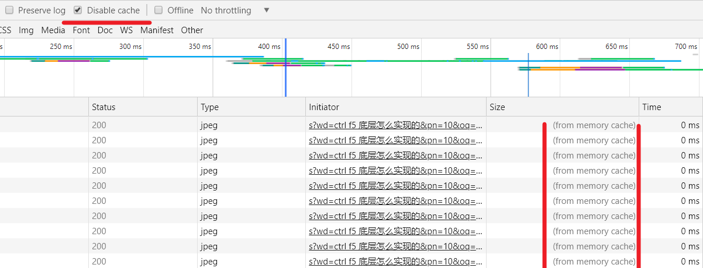
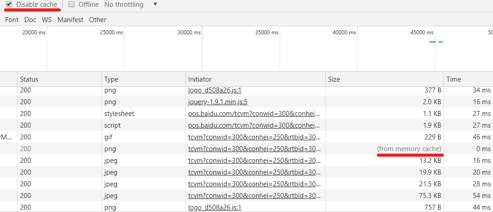
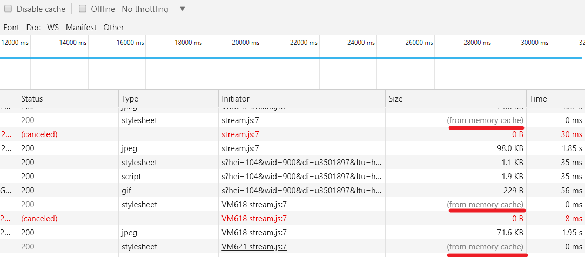
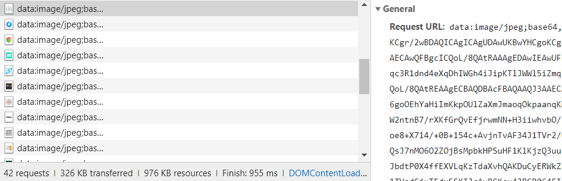

## 问题由来

随便打开一个百度页面，不管是按 `ctrl+f5` 与 启用 `Disable cache` 选项还是会出现从内存中读取文件的现象。

打开 csdn 的一个博客网站，启用`Disable cache`也会出现与上例相似的现象，并且单独按`ctrl+f5`后有更多文件被从缓存读取。

##### Disable cache

##### ctrl+f5

## 答案

> 先从浏览器的缓存策略说起，因为上面问题只涉及强缓存，所以就只简单说明一下强缓存，如果要详细了解两种缓存，可以借鉴一下下面这个博文。

[<https://github.com/frontend9/fe9-interview/issues/29>](To zhijianzhang: 浏览器的强缓存和协商缓存)

#### 强缓存

强缓存主要受**响应头**中的 `Cache-Control` 和 `Expires` 两个字段控制。

在浏览器第一次进行请求时会根据这两个字段值来控制文件的缓存。如果同时存在，`Cache-Control`优先级高于`Expires`。

在第二次请求的时候，浏览器会根据缓存文件的响应头来判断是否从缓存拿文件。

然后我们看一下`ctrl+f5`与`Disable cache`分别做了什么能够实现从服务器获取最新鲜的资源。

#### ctrl+f5

`ctrl+f5` 被称为**硬性重新加载**。也就是**强制刷新**。

作用：跳过判断缓存响应头阶段（不明确底层到底做了什么，可能是跳过，可能是改了相应的响应头，如果有知道的，能告知一下就太感谢了），直接禁止请求时候使用缓存。同时在请求头中加入 `Pragma: no-cache`或 `Cache-Control: no-cache` 字段,或者两者兼有（不同浏览器有些许出入），来禁用协商缓存，同时告知代理服务器，不要使用代理服务器上的缓存。

#### Disable cache

作用：每次请求之前，清空缓存，导致请求无缓存可用，并同样地在请求头中加入 `Pragma: no-cache`或 `Cache-Control: no-cache` 字段，以便获取最新的资源。

-----

> 既然两者都能够阻止浏览器调用缓存，那为什么在请求中还会出现从内存或者硬盘获取文件的情况呢。

原来在百度中发现的从缓存读取的文件都是`base64`格式的图片文件

其依附在其他文件中从服务器请求到客户端，并在构建dom树的时候在内存中加载并解析。完毕后从内存中拿出来，就出现了强缓存的假相。

> 但是在 csdn 的那个案例中，有些文件并不是`base64`格式的，在`ctrl+f5`之后依旧会从缓存读取，而开启了Disable cache 后这些文件又会重新去服务器请求。

原来对这些文件的请求都是异步的，`ctrl+f5`只不过能够管控`<link>`、`<script>`、``、`<frame>`等`dom`标签，还有样式中`background:url()`、`@font-face()`等文件外链阻止它们去访问缓存,对于`ajax`请求无能为力。

而 `Disable cache` 在每次请求之前，直接将清空了相应缓存，从根源阻止了浏览器的缓存相关策略，所以这时ajax请求也不能使用缓存了。